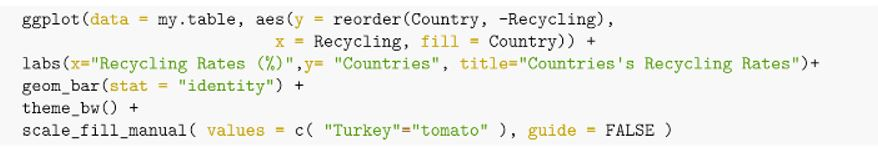
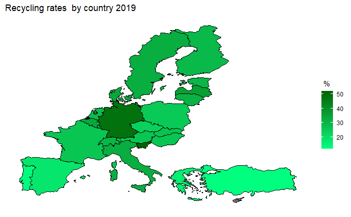
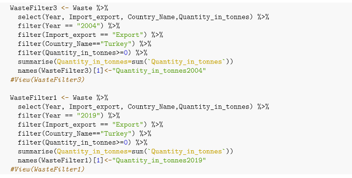

```{r setup, include=FALSE}
knitr::opts_chunk$set(echo = FALSE)
```

## What is recycling but first, we will define the waste
<middle>
<center>
```{r echo=FALSE, results='asis'}

```
</middle>
</center>

## Recycling
<middle>
<center>
```{r echo=FALSE, results='asis'}

```

</middle>
</center>


## Landfill
<middle>
<center>
```{r echo=FALSE, results='asis'}

```
</middle>
</center>


## Composting
<middle>
<center>
```{r echo=FALSE, results='asis'}

```
</middle>
</center>

## Incineration with or without energy recovery
<middle>
<center>
```{r echo=FALSE, results='asis'}

```
</middle>
</center>


## Importance of recycling
<middle>
<center>
```{r echo=FALSE, results='asis',out.width='95%', out.height='95%', fig.cap=''}
knitr::include_graphics('img/resim9.jpg')
```
</middle>
</center>

## Problem definition
So, to what extent is recycling, which is of great importance for our world, implemented?

<middle>
<center>
```{r echo=FALSE, results='asis',out.width='85%', out.height='85%', fig.cap=''}
knitr::include_graphics('img/resim10.jpg')
```
</middle>
</center>


## Project Goal: Awareness

<middle>
<center>
```{r echo=FALSE, results='asis', out.width='105%', out.height='105%', fig.cap=''}

```
</middle>
</center>


## Social Benefits of Project

<middle>
<center>
```{r echo=FALSE, results='asis',  out.width='100%', out.height='100%', fig.cap=''}

```
</middle>
</center>


## 

<middle>
<center>
```{r echo=FALSE, results='asis',  out.width='100%', out.height='100%', fig.cap=''}
knitr::include_graphics('img/title2.PNG')
```
```{r echo=FALSE, results='asis',  out.width='50%', out.height='50%', fig.cap=''}

```
</middle>
</center>
  
  
## Project data

* [**Municipal waste recycled and composted in each European country**](https://www.eea.europa.eu/data-and-maps/daviz/municipal-waste-recycled-and-composted-3#tab-chart_3_filters=%7B%22rowFilters%22%3A%7B%7D%3B%22columnFilters%22%3A%7B%7D%3B%22sortFilter%22%3A%5B%22value_2016_reversed%22%5D%7D)
  
* [**Recycling rates by country**](https://en.wikipedia.org/wiki/Recycling_rates_by_country)   

* [**GDP of European countries in 2019**](https://www.statista.com/statistics/685925/gdp-of-european-countries/)

* [**Waste shipment statistics**](https://ec.europa.eu/eurostat/statistics-explained/index.php?title=Waste_shipment_statistics#Shipments_of_hazardous_waste_within_and_out_of_the_EU)  

* [**Waste shipments across borders**](https://ec.europa.eu/eurostat/web/waste/data)  

* [**Per capita municipal waste generation in the European Union in 2019**](https://www.statista.com/statistics/789638/production-waste-tons-by-inhabitant-union-european/)  

\  


## Packages
* tidyverse
* readr
* readxl
* ggplot2
* rvest
* ggpubr
* dplyr
* rnaturalearth
* rnaturalearthdata
* rgeos
* grid
* rworldmap


## Recycling Rates

<middle>
<center>
```{r echo=FALSE, results='asis', out.width='105%', out.height='105%', fig.cap=''}

```
</middle>
</center>
 
As we can the our output Slovenia's Recycling Rate in 2019 is the highest one.
Compare to Slovenia Turkey Recycling rate in 2019 is one of the lowest.   
<middle>
<center>
```{r echo=FALSE, results='asis', out.width='105%', out.height='105%', fig.cap=''}

```
</middle>
</center>


  

  
## Recycling Rates

<middle>
<center>
```{r echo=FALSE, results='asis', out.width='105%', out.height='105%', fig.cap=''}

```
</middle>
</center>

## Landfill Rates

<middle>
<center>
```{r echo=FALSE, results='asis', out.width='105%', out.height='105%', fig.cap=''}

```
</middle>
</center>

## Landfill Rates

<middle>
<center>
```{r echo=FALSE, results='asis', out.width='105%', out.height='105%', fig.cap=''}

```
</middle>
</center>

## Recycling and Landfill

<middle>
<center>
```{r echo=FALSE, results='asis', out.width='105%', out.height='105%', fig.cap=''}

```
</middle>
</center>

## IER and Landfill

<middle>
<center>
```{r echo=FALSE, results='asis', out.width='105%', out.height='105%', fig.cap=''}

```
</middle>
</center>


## Turkey Recyling and Landfill

<middle>
<center>
```{r echo=FALSE, results='asis', out.width='105%', out.height='105%', fig.cap=''}

```
</middle>
</center>

## Municipal waste recycled and composted
<middle>
<center>
```{r echo=FALSE, out.width='100%', out.height='100%'}

```
</middle>
</center>

## Municipal waste recycled and composted
<middle>
<center>
```{r echo=FALSE, out.width='100%', out.height='100%'}

```
</middle>
</center>

## Total volume of waste

<middle>
<center>
```{r echo=FALSE, results='asis', out.width='105%', out.height='105%', fig.cap=''}

```
</middle>
</center>

## Total volume of waste

<middle>
<center>
```{r echo=FALSE, results='asis', out.width='105%', out.height='105%', fig.cap=''}

```
</middle>
</center>


## Recycling Rates

<middle>
<center>
```{r echo=FALSE, results='asis', out.width='105%', out.height='105%', fig.cap=''}

```
</middle>
</center>


## Red Map

<middle>
<center>
```{r echo=FALSE, results='asis', out.width='105%', out.height='105%', fig.cap=''}

```
</middle>
</center>

## Red Map

<middle>
<center>
```{r echo=FALSE, results='asis', out.width='105%', out.height='105%', fig.cap=''}

```
</middle>
</center>


## Green Map

<middle>
<center>
```{r echo=FALSE, results='asis', out.width='105%', out.height='105%', fig.cap=''}

```
</middle>
</center>

## Turkey Total Export in 2019 vs in 2004 


<middle>
<center>

```{r echo=FALSE, results='asis', out.width='105%', out.height='105%', fig.cap=''}

```
</middle>
</center>

## Turkey Total Export in 2019 vs in 2004 


<middle>
<center>
\
\
\
\
```{r echo=FALSE, results='asis', out.width='105%', out.height='105%', fig.cap=''}

```
</middle>
</center>


## Treatment waste

<middle>
<center>
```{r echo=FALSE, results='asis', out.width='105%', out.height='105%', fig.cap=''}

```
</middle>
</center>

## GDP vs Total waste
\
\
\
<middle>
<center>
```{r echo=FALSE, results='asis', out.width='105%', out.height='105%', fig.cap=''}

```
</middle>
</center>

## GDP vs Total waste

<middle>
<center>
```{r echo=FALSE, results='asis', out.width='105%', out.height='105%', fig.cap=''}

```
</middle>
</center>

## Conclusion
<middle>
<center>
```{r echo=FALSE, results='asis', out.width='105%', out.height='105%', fig.cap=''}

```
</middle>
</center>

## Conclusion
<middle>
<center>
```{r echo=FALSE, results='asis', out.width='105%', out.height='105%', fig.cap=''}
knitr::include_graphics('img/resim13.jpg')
```
</middle>
</center>


## **References**
* https://data.oecd.org/waste/municipal-waste.htm
* https://en.wikipedia.org/wiki/Landfill
* https://www.epa.gov/recycle/recycling-basics
* https://www.statista.com/statistics/789638/production-waste-tons-by-inhabitant-union-european/ 
* https://ec.europa.eu/eurostat/web/waste/data
* https://ec.europa.eu/eurostat/statistics-explained/index.php?title=Waste_shipment_statistics#Shipments_of_hazardous_waste_within_and_out_of_the_EU
* https://www.statista.com/statistics/685925/gdp-of-european-countries/
* Lecture Notes

  
  
##

<middle>
<center>
```{r echo=FALSE, results='asis', out.width='100%', out.height='100%', fig.cap=''}

```
</middle>
</center>
